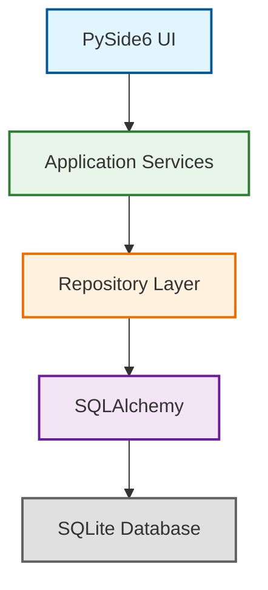

# Petrol Pump ERP - System Architecture

## Overall Architecture

The system follows a clean modular desktop architecture with clear separation of concerns:

```
┌──────────────────────────────┐
│        PySide6 UI              │
├──────────────────────────────┤
│      Application Layer         │
├──────────────────────────────┤
│       Domain Services          │
├──────────────────────────────┤
│       Repository Layer         │
├──────────────────────────────┤
│        SQLAlchemy              │
├──────────────────────────────┤
│          SQLite                │
└──────────────────────────────┘
```

## Layered Architecture

### 1. Presentation Layer (PySide6 UI)
- All UI widgets and windows
- Minimal business logic - only UI-specific concerns
- Data binding and display
- User input handling
- Printing and export UI
- Notifications and alerts

### 2. Application/Service Layer
- **Application Services**: Orchestrate use cases
- **Domain Services**: Core business rules
- Validation logic
- Permission checking
- Transaction coordination
- Report generation coordination

### 3. Domain Layer
- **Entities**: Business objects (Employee, Sale, Shift, etc.)
- **Value Objects**: Descriptive objects without behavior
- Business rules and invariants
- Domain events

### 4. Repository Layer
- Abstract data access
- Interface for data operations
- CRUD operations
- Query methods
- Transaction management

### 5. SQLAlchemy Layer
- ORM models
- Database schema definition
- Relationships
- Foreign key constraints
- Indexes

### 6. SQLite
- Single-file database
- WAL mode enabled
- Foreign key constraints
- Proper normalization

## Technology Choices

### Python 3.13+
Modern Python features, performance improvements, type hinting support.

### PySide6
- Qt for Python
- Native desktop application
- Cross-platform (Windows, macOS, Linux)
- Robust printing capabilities
- Established UI framework

### SQLite
- Single-file database
- Zero configuration
- Offline-first by design
- No server process required
- ACID compliant
- Well-suited for single-user desktop application

### SQLAlchemy 2.x
- Modern ORM
- Full featureset
- SQLite optimization
- Migration support via Alembic
- Clean separation between objects and SQL

### Alembic
- Database migration management
- Version-controlled schema changes
- Rollback capabilities
- Safe schema evolution

### ReportLab
- Professional PDF generation
- Complex layout support
- Chart and table generation
- Print-ready documents

### openpyxl
- Excel file generation
- Data export capabilities
- Familiar format for users
- Template-based reports

### pydantic-settings
- Configuration management
- Environment variable support
- Type-safe settings
- Default values

### Python logging
- Structured logging
- Multiple output targets
- Log levels
- Rotating file handlers

### PyInstaller
- Single executable packaging
- Offline deployment
- No Python dependency requirements for end users
- Resource bundling

## Module Structure

The application is organized into modules, each following the same architecture:

```
authentication/
employees/
attendance/
shifts/
nozzles/
tanks/
inventory/
procurement/
suppliers/
sales/
payments/
credit/
expenses/
reconciliation/
hr/
reports/
printing/
backups/
audit/
```

Each module contains:
- **Repository**: Data access layer
- **Service**: Business logic
- **Schemas**: Pydantic models for validation
- **UI components**: PySide6 widgets

## Module Responsibilities

### Authentication Module
- User login/logout
- Password management
- Session management
- RBAC permission checks
- Audit logging of access

### Employees Module
- Employee master data
- Role assignment
- Department management
- Document tracking

### Attendance Module
- Check-in/Check-out tracking
- Shift attendance
- Leave management
- Late arrival tracking
- Overtime calculation

### Shifts Module
- Shift opening/closing
- Nozzle assignments
- Meter readings
- Sales tracking
- Reconciliation

### Nozzles Module
- Nozzle assignment tracking
- Opening/closing readings
- Sales per nozzle
- Status monitoring

### Tanks Module
- Tank inventory tracking
- Fuel type management
- Dip readings
- Tank transactions
- Variance calculation

### Sales Module
- Sale recording
- Payment processing
- Cancellation/reversal
- Customer tracking
- Receipt generation

### Payments Module
- Cash handling
- UPI payments
- Card payments
- Credit transactions
- Reconciliation tracking

### Credit Module
- Customer credit accounts
- Credit limits
- Outstanding tracking
- Invoice generation
- Payment posting

### Expenses Module
- Expense tracking
- Category management
- Receipt management
- Approval workflow
- Report generation

### Reconciliation Module
- Cash reconciliation
- Fuel reconciliation
- UPI reconciliation
- Card reconciliation
- Expense reconciliation
- Variance analysis

### Reports Module
- Daily reports
- Shift reports
- Attendant reports
- Financial reports
- Management reports
- Custom report generation

### Printing Module
- Receipt printing
- Report printing
- Label printing
- PDF export
- Excel export

### Backups Module
- Automatic scheduled backups
- Manual backup
- Backup verification
- Restore capability
- Backup history

### Audit Module
- Complete audit trail
- Login/logout tracking
- Change tracking
- Who/what/when/why
- Device information

## Data Flow

```
User Input (UI)
        ↓
Validation (Service Layer)
        ↓
Repository (Data Access)
        ↓
SQLAlchemy ORM
        ↓
SQLite Database
        ↑
Repository (Data Access)
        ↑
Response (UI)
```

## Key Design Principles

### 1. Offline-First
- All operations work without internet
- SQLite single-file database
- No cloud dependency
- Local backup only

### 2. Data Integrity
- Foreign key constraints
- Transactions for all financial operations
- Audit logging for all changes
- Never silently change historical data
- VOID/REVERSE/ADJUST instead of DELETE/OVERWRITE

### 3. Separation of Concerns
- Business logic in services, not UI
- Data access in repositories, not SQL everywhere
- Domain models clean of database details
- UI thin - presentation only

### 4. Maintainability
- Clear module boundaries
- Proper documentation
- Test coverage
- Type hints where possible
- Consistent coding patterns

### 5. Security
- RBAC throughout
- Password hashing
- Audit logging
- Permission checks on all operations
- Secure defaults

## Diagrams

### System Architecture Diagram


### Database ER Diagram
(Will be created in docs/05-database-design.md)

### Business Workflow Diagrams
(Will be created in docs/ directory)

## Repository Pattern

Each entity has a repository that abstracts data access:

```python
class EmployeeRepository:
    def get_by_id(self, employee_id: UUID) -> Employee | None:
        ...
    
    def get_all_active(self) -> List[Employee]:
        ...
    
    def create(self, employee: EmployeeCreate) -> Employee:
        ...
    
    def update(self, employee: EmployeeUpdate) -> Employee:
        ...
    
    def delete(self, employee_id: UUID) -> None:
        # Never delete financial/historical data
        # Use void/reverse/adjust pattern instead
        ...
```

## Service Pattern

Each business domain has services that contain the business logic:

```python
class ShiftService:
    def open_shift(self, employee: Employee, shift_date: date) -> Shift:
        # Business rules for shift opening
        ...
    
    def close_shift(self, shift: Shift, attendant: Employee) -> Reconciliation:
        # Business rules for shift closing
        ...
    
    def assign_nozzle(self, shift: Shift, employee: Employee, nozzle: Nozzle) -> NozzleAssignment:
        # Business rules for nozzle assignment
        ...
```

## Configuration

All configuration uses pydantic-settings with environment variable support:

```python
class Settings(BaseSettings):
    DATABASE_URL: str = "sqlite:///petrol_pump.db"
    SECRET_KEY: str = secrets.token_hex(32)
    DEBUG: bool = False
    LOG_LEVEL: str = "INFO"
    
    class Config:
        env_file = ".env"
```

## Logging

Structured logging throughout the application:

```python
logger = logging.getLogger(__name__)

logger.info("Shift opened", extra={"shift_id": str(shift.id)})
logger.warning("Cash variance detected", extra={"variance_amount": variance, "shift_id": str(shift.id)})
logger.error("Database error", exc_info=True, extra={"operation": "shift_close"})
```

Logs include:
- Timestamp
- Logger name
- Log level
- Message
- Contextual extra data (shift_id, operation, etc.)