# Petrol Pump ERP

A desktop-only, offline-first Petrol Pump Management ERP built with Python, SQLAlchemy 2.x, and PySide6. It is designed to run entirely on a petrol pump's local computer with **no internet connection required** — there is no web server, no cloud database, and no remote sync in this phase of the project (see [Two-phase plan](#two-phase-plan) below).

This README is the detailed, up-to-date entry point for the project. It reflects what is actually built and tested today, not the full aspirational scope — for that, see [ROADMAP.md](ROADMAP.md) and [PROJECT_CONTEXT.md](PROJECT_CONTEXT.md).

---

## Table of Contents

- [Screenshots](#screenshots)
- [What's built so far](#whats-built-so-far)
- [Technology stack](#technology-stack)
- [Project structure](#project-structure)
- [Getting started](#getting-started)
- [Running the app](#running-the-app)
- [Running the tests](#running-the-tests)
- [Building a standalone Windows executable](#building-a-standalone-windows-executable)
- [Architecture](#architecture)
- [Security & data-integrity model](#security--data-integrity-model)
- [Database](#database)
- [Two-phase plan](#two-phase-plan)
- [Documentation index](#documentation-index)
- [Roadmap status](#roadmap-status)

---

## Screenshots

<table>
<tr>
<td width="50%">

**Login**

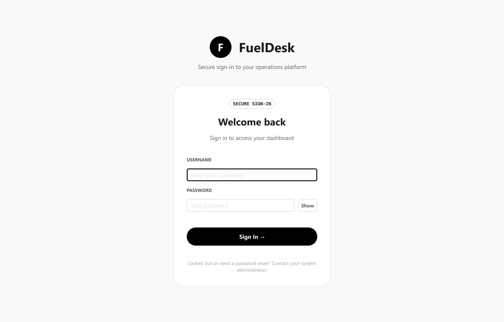

</td>
<td width="50%">

**Login — invalid credentials**

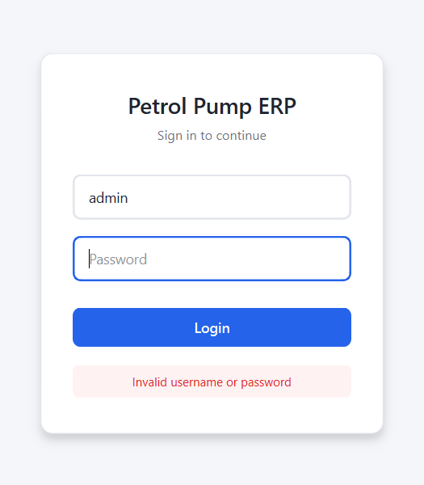

</td>
</tr>
<tr>
<td width="50%">

**Main window**

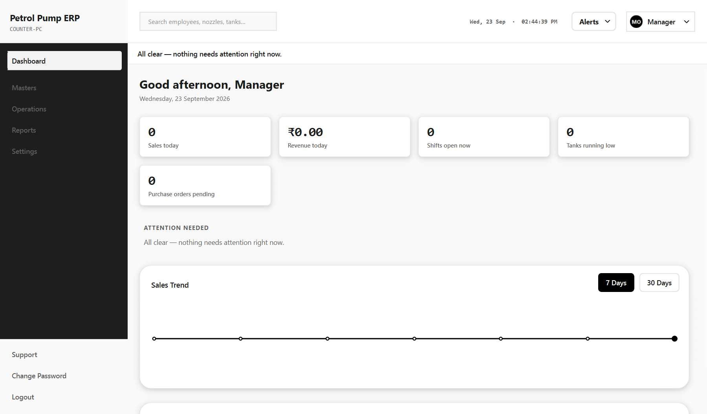

</td>
<td width="50%">

**Employee list**

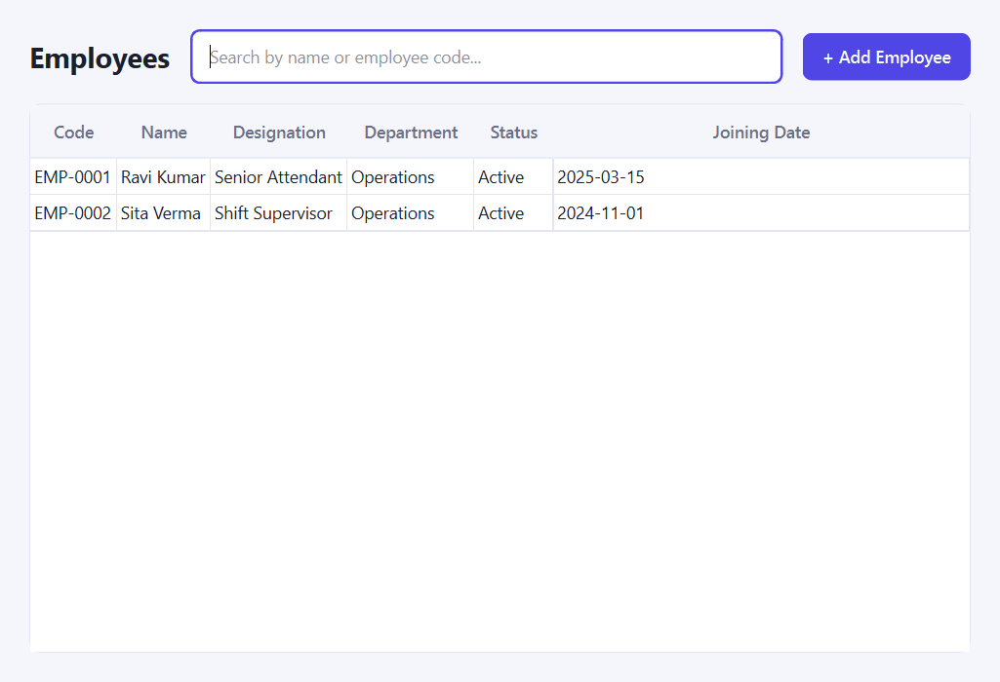

</td>
</tr>
<tr>
<td width="50%">

**Add employee**

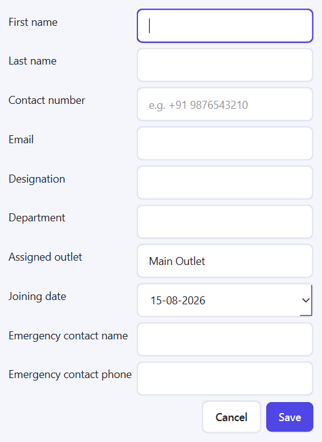

</td>
<td width="50%">

**Employee detail**

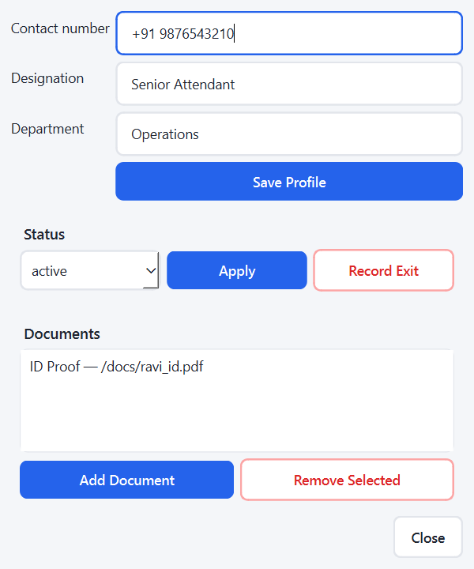

</td>
</tr>
<tr>
<td width="50%">

**Attendance roster**

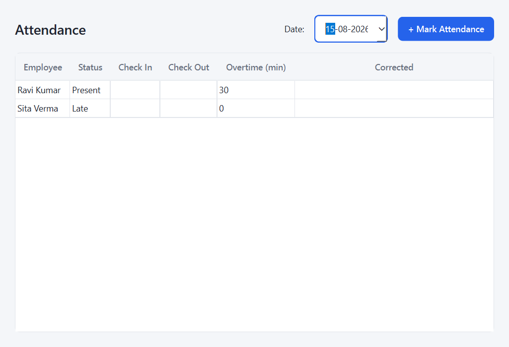

</td>
<td width="50%">

**Mark attendance**

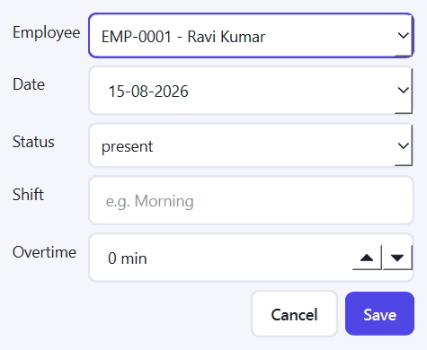

</td>
</tr>
<tr>
<td width="50%">

**Shift list**

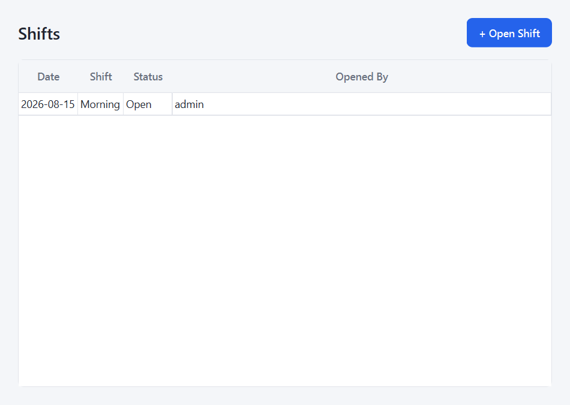

</td>
<td width="50%">

**Shift detail — nozzle assignments**

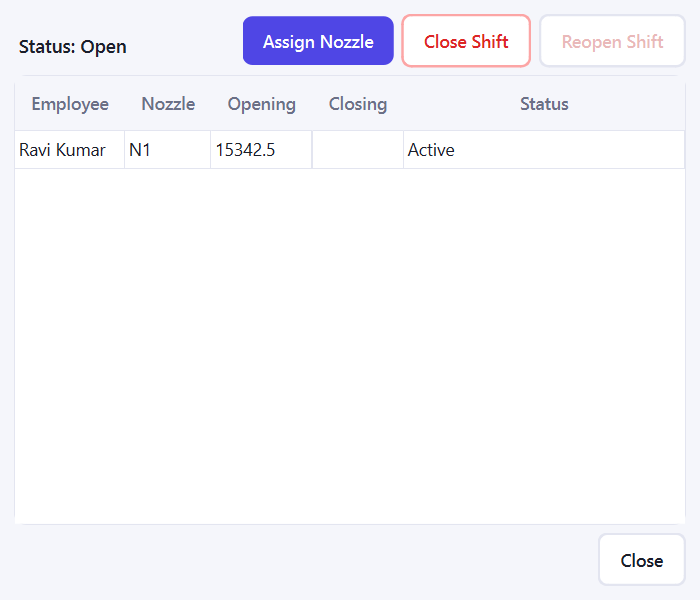

</td>
</tr>
<tr>
<td width="50%">

**Nozzle management — dispensers**

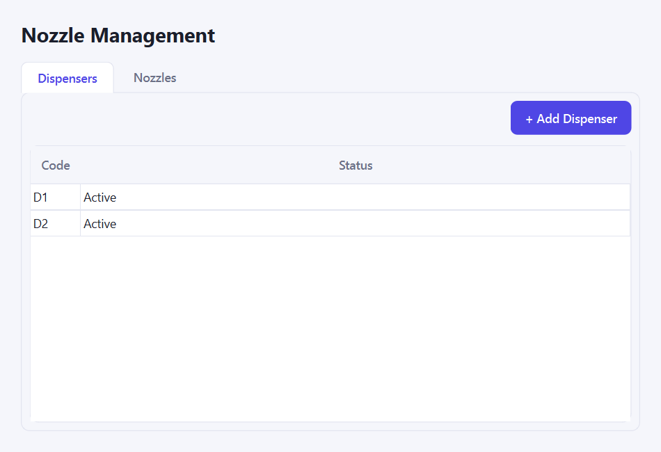

</td>
<td width="50%">

**Nozzle management — nozzles**

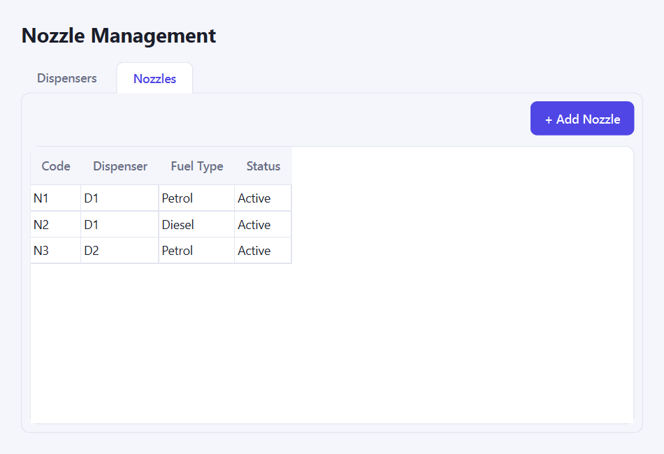

</td>
</tr>
</table>

---

## What's built so far

Everything below is implemented, tested, and running — not planned. Each module follows the same shape: SQLAlchemy model → repository → service (business rules, RBAC, audit logging) → PySide6 UI, with a Pydantic schema for input validation where the input has more than one or two fields.

### Authentication & RBAC (Phase 4 — complete)
- Login/logout with a styled login screen, session tokens (SHA-256 hashed at rest, never stored raw), and configurable session expiry with **auto-logout**
- Six business roles seeded automatically: `ADMIN`, `OWNER`, `MANAGER`, `ACCOUNTANT`, `SHIFT_SUPERVISOR`, `ATTENDANT`, each with a starter permission set that grows as new modules are added
- Account lockout after 5 failed login attempts; generic "invalid username or password" errors (no username enumeration)
- Password hashing via PBKDF2-HMAC-SHA256 (200,000 iterations, random per-password salt) — never plaintext
- A password policy (`validate_password_strength`) and a `require_permission` decorator used by every service method that needs an authorization check
- Every authentication event (login success/failure/lockout, logout, session expiry) is written to an **immutable, append-only audit log**

### Employee & HR Management (Phase 5 — complete)
- Employee master data distinct from login accounts (`Employee.user_id` optionally links to a `User`, but HR records can exist without login access)
- Auto-generated sequential employee codes (`EMP-0001`, ...)
- Document tracking (ID proof, etc.) with soft-delete, never a hard delete
- Status lifecycle (`active` / `on_leave` / `suspended` / `terminated`) and exit tracking via `exit_date` — **an employee record is never deleted**, only its status changes, with every change audit-logged
- Full search/list/add/edit UI

### Attendance Management (Phase 6 — complete)
- Daily attendance roster, filterable by date
- Statuses: present, absent, late, half-day, leave, holiday; check-in/check-out times; overtime tracking
- One record per employee per day — marking twice is rejected
- **Correction workflow**: changing an already-marked record requires a non-blank reason, a stricter permission check, and is audit-logged with the old and new values — never a silent overwrite

### Shift Management (Phase 7 — complete, reconciliation deferred)
- Shift open/close lifecycle — one shift per (date, label), e.g. "Morning" on a given day
- Attendant-to-nozzle assignment with opening meter readings; prevents assigning the same employee twice or the same nozzle to two people within a shift
- Closing meter readings required before an assignment can be marked complete (closing must be ≥ opening)
- A shift cannot be closed while any nozzle assignment is still active
- **Controlled reopening**: reopening a closed shift requires a stricter permission (not granted to `SHIFT_SUPERVISOR`) and a reason, and is audit-logged — a closed shift is never freely editable
- Full cash/UPI/card/fuel reconciliation is intentionally deferred to Phase 15, once the sales/payments/inventory modules it depends on exist

### Nozzle Management (Phase 8 — complete, full reports deferred)
- Dispenser and Nozzle master data: create, and change status (active/inactive/maintenance) with a required reason, audit-logged
- A nozzle can only be created under an active dispenser; deactivating a nozzle that's currently assigned in an open shift is blocked
- Every dispenser has exactly 2 nozzles (confirmed business rule, enforced — a 3rd nozzle on the same dispenser is rejected); each nozzle dispenses one fuel type, commonly Petrol, Diesel, or Power (seeded by default)
- Tabbed management screen (Dispensers / Nozzles) gated on view/manage permissions, same as every other module
- **Attendant self-service "My Shift" view**: a logged-in attendant sees their own current nozzle/fuel/dispenser assignment and opening meter reading on a dedicated screen — previously attendants saw a completely empty dashboard since their role had no permissions at all

### Tank & Inventory Management (Phase 9 — complete, full reports deferred)
- Tank master data (distinct from a nozzle's fuel-type lookup — a pump can have multiple tanks per fuel type), status changes with a required reason
- Dip readings recorded as observations that never silently change book stock
- Transactions: receipt, issue, adjustment — rejects overflow past capacity, negative stock, or an adjustment with no reason
- Fuel reconciliation: expected closing stock (opening + received − sold) compared against a physical reading, variance classified against configurable thresholds (normal/warning/investigation-required/approval-required) — never assumed to be theft; an accepted reconciliation becomes the new baseline

### Reports (fuel-type-sectioned, full reporting module deferred to Phase 16)
- A dedicated Reports screen, sectioned by fuel type (Petrol / Diesel / Power), showing tank count, total capacity, current stock, nozzle/active-nozzle counts, and the latest reconciliation variance per fuel type
- Print/Preview/PDF/Excel export are not yet implemented for any report (required by the project's reporting rules, tracked as pending work)

### User Management (Phase 4 extension — complete)
- Admins/owners can create login accounts for any of the six roles, with multiple users allowed per role (several attendants, several accountants, etc.)
- Password strength is validated on every new account (the existing policy, now actually wired in for the first time)
- Activate/deactivate, unlock a locked account, and change a user's role — every action requires a non-blank reason and is audit-logged; accounts are never deleted
- The "Users" button/dashboard card is only visible to roles holding `Permission.USER_MANAGE` (ADMIN/OWNER), following the same permission-gated visibility pattern used by every module — a logged-in user only ever sees the buttons and pages their role actually grants them
- Self-service password change, plus a forced, un-skippable rotation right after login whenever an admin just set the account's password (new account or an explicit reset) — closes the "the temp password stays permanent" and "a forgotten password has no recovery path" gaps

### Real database migrations, backup & restore (hardened 2026-08-16)
- Schema changes go through Alembic (`app/database/migrations.py`), not a blunt `create_all()` — `init_db()` runs `alembic upgrade head` on every launch, including the very first one
- A backup is taken automatically before any migration that's actually about to change an existing database, and can also be triggered manually from the Backups screen — both use SQLite's own online backup API so a backup taken mid-write (WAL mode) is still transactionally consistent, not a torn file copy
- Restoring from a backup takes its own safety backup first, requires a reason, and is audit-logged, so a bad restore choice is itself recoverable
- Every money/volume figure (fuel price, tank capacity/stock, meter readings, reconciliation numbers) is stored as `Numeric`/`Decimal`, not `Float`, so business-logic arithmetic can't silently accumulate binary-float rounding drift

### Audit log viewer & report export (2026-08-16)
- The audit trail (written by every service action since Phase 4) now has an actual screen to read it on — filterable by event type, actor, and date range, gated on `Permission.AUDIT_VIEW`
- The fuel-type summary report supports Print, PDF export, and Excel export, not just an on-screen view — the pattern the rest of Phase 16's reports will reuse

### Database integrity & exception handling (cross-cutting, hardened 2026-08-15)
- SQLite foreign-key enforcement (`PRAGMA foreign_keys=ON`) and WAL mode (`PRAGMA journal_mode=WAL`) are enabled on every connection — every `ForeignKey()` declared in the models is actually enforced by the database, not just by application code
- Every repository write commits through a shared `safe_commit()` helper that rolls back cleanly on failure, so a failed write can't leave a session unusable for the rest of that login
- Application startup (`app/main.py`) wraps database init/seed failures into a single `DatabaseInitializationError` with a clear message and a logged traceback, instead of crashing with a raw stack trace
- Every UI dialog's save/action handler catches its specific errors (validation, business-rule conflicts) for a precise message, then falls back to a generic "something went wrong" message for anything unexpected — logged in full, never left to crash the app or a Qt event-loop callback

Not yet built: Procurement, Sales, Payments, Credit, Expenses, full Reconciliation module, full Reporting System (print/PDF/Excel export), Printing, Backup/Restore. See [ROADMAP.md](ROADMAP.md) for the full phase-by-phase plan.

---

## Technology stack

| Concern | Choice | Status |
|---|---|---|
| Language | Python 3.13+ | in use |
| Desktop UI | PySide6 (Qt for Python) | in use |
| Database | SQLite (single file, WAL mode, FK enforcement) | in use |
| ORM | SQLAlchemy 2.x | in use |
| Validation | Pydantic v2 | in use |
| Configuration | pydantic-settings | in use |
| Testing | pytest | in use — 265 tests |
| Logging | Python standard `logging` | in use — console + a rotating file colocated with the database |
| Migrations | Alembic | in use — `init_db()` runs `alembic upgrade head`, not `Base.metadata.create_all()` |
| PDF reports | ReportLab | in use — fuel-type summary report, more reports to follow in Phase 16 |
| Excel reports | openpyxl | in use — fuel-type summary report, more reports to follow in Phase 16 |
| Packaging | PyInstaller | in use — see [Building a standalone Windows executable](#building-a-standalone-windows-executable) |
| CI | GitHub Actions | in use — `.github/workflows/tests.yml` runs the full suite on every push/PR |

This table is deliberately honest about what's a real dependency today (see `requirements.txt`) versus what's still on the roadmap.

---

## Project structure

```
PetrolPumpERP/
├── app/
│   ├── main.py                 # Entry point: init DB, seed data, launch UI
│   ├── core/
│   │   ├── config.py            # pydantic-settings app configuration
│   │   ├── constants.py         # Roles, permissions, status enums, policy constants
│   │   ├── exceptions.py        # AppError hierarchy (NotFoundError, ConflictError, ...)
│   │   ├── logging.py
│   │   ├── permissions.py       # @require_permission decorator
│   │   └── security.py          # Password hashing/policy, session token hashing
│   ├── database/
│   │   ├── connection.py        # Engine, SessionLocal, FK/WAL PRAGMA setup
│   │   ├── base.py              # Declarative Base, EntityMixin, StatusEnum
│   │   └── seed.py              # Seeds roles, permissions, and the admin user
│   ├── models/                  # SQLAlchemy ORM models (one file per entity)
│   ├── repositories/            # Data access layer — one repository per model
│   ├── schemas/                 # Pydantic input-validation schemas
│   ├── services/                # Business logic, RBAC checks, audit logging
│   └── ui/                      # PySide6 windows/dialogs + shared stylesheet
├── tests/                       # pytest suite (265 tests)
├── docs/
│   └── screenshots/             # Screenshots used in this README
├── requirements.txt
├── README.md                    # You are here
├── PROJECT_CONTEXT.md            # Living project memory: what's done, pending, known issues
├── ARCHITECTURE.md               # Layered architecture, module responsibilities, diagrams
├── ROADMAP.md                    # Phase-by-phase plan with granular checklists
└── CLAUDE.md                     # Instructions for AI coding agents working on this repo
```

---

## Getting started

**Requirements:** Python 3.13+, Windows/macOS/Linux (developed and tested on Windows).

```bash
# Clone the repository
git clone https://github.com/Rahil-Mokashi/initial-capstone.git
cd initial-capstone

# Create and activate a virtual environment
python -m venv venv
venv\Scripts\activate          # Windows
source venv/bin/activate       # macOS/Linux

# Install dependencies
pip install -r requirements.txt
```

## Running the app

```bash
python -m app.main
```

On first run this will:
1. Create `app/petrol_pump.db` (SQLite, WAL mode, foreign keys enforced)
2. Seed the six business roles and their baseline permissions
3. Seed a default admin account
4. Launch the login window (or print a CLI fallback message if PySide6 isn't installed)

**Default admin login:**

| Field | Value |
|---|---|
| Username | `admin` |
| Password | `Admin@123` |

⚠️ This is a seeded development credential (see `app/database/seed.py`, `DEFAULT_ADMIN_PASSWORD`). It must be changed before any real deployment — there is no forced password-change-on-first-login flow yet.

## Running the tests

```bash
pytest
```

All 265 tests should pass, in well under a minute. To run a single module's tests:

```bash
pytest tests/test_auth_rbac.py -v
pytest tests/test_employee_service.py tests/test_employee_ui.py -v
pytest tests/test_attendance_service.py tests/test_attendance_ui.py -v
pytest tests/test_shift_service.py tests/test_shift_ui.py -v
pytest tests/test_nozzle_service.py tests/test_nozzle_ui.py -v
pytest tests/test_tank_service.py tests/test_tank_ui.py -v
pytest tests/test_database_integrity.py -v
```

UI tests drive real PySide6 widgets (not mocks) but never call `.exec()` on a modal dialog — `QMessageBox`/`QInputDialog`/`QFileDialog` calls are monkeypatched where a test needs to simulate a user's choice, so the suite runs headlessly without hanging on a dialog waiting for a click that will never come.

---

## Building a standalone Windows executable

To hand the app to someone without them installing Python or any dependencies:

```bash
pip install -r requirements-build.txt
pyinstaller petrol_pump_erp.spec
```

This produces a single file, `dist/PetrolPumpERP.exe` (~90MB — PySide6/Qt is the bulk of that). Copy that one file to any Windows PC and double-click it to run; nothing else needs to be installed.

**Each install gets its own fresh, persistent database automatically.** This matters more than it sounds: a PyInstaller onefile build re-extracts itself to a new temporary directory on *every single launch*, so resolving the database path relative to the running executable (as a normal dev checkout does) would silently wipe the database on every restart once packaged. `app/database/connection.py` detects the frozen/packaged state and instead stores the database at `%LOCALAPPDATA%\PetrolPumpERP\petrol_pump.db` — a stable location that survives restarts and is private to whichever Windows user account runs it. This is covered by `tests/test_core_setup.py::test_frozen_build_uses_per_user_app_data_dir_not_temp_extraction_path`.

On first launch on a new PC, the app creates that database, seeds the six roles/permissions and default fuel types, and creates the same dev admin login described above (`admin` / `Admin@123`) — change it before real use.

⚠️ `petrol_pump_erp.spec` intentionally bundles matplotlib/PIL/tkinter even though this app doesn't use them directly — excluding them was tried and broke PySide6's Qt platform-plugin bundling (the app exited silently right after startup, no window, no error). See the comment at the top of the spec file for the full story before trying to slim the build down.

---

## Architecture

Clean layered architecture, enforced by convention (see [ARCHITECTURE.md](ARCHITECTURE.md) for the full picture and diagrams):

```
PySide6 UI  →  Service Layer  →  Repository Layer  →  SQLAlchemy  →  SQLite
```

- **UI** (`app/ui/`): presentation only. Widgets call a service method and render the result or the exception it raises — no business logic, no direct database access.
- **Service** (`app/services/`): owns business rules, permission checks (`@require_permission`), and audit logging. This is where "can this happen" and "who did this and why" live.
- **Repository** (`app/repositories/`): the only layer that talks SQL/SQLAlchemy. No business logic here — just data access.
- **Models** (`app/models/`): SQLAlchemy ORM entities. UUID primary keys throughout, foreign keys actually enforced by SQLite (see [Database](#database)).

## Security & data-integrity model

- **RBAC everywhere**: every service method that mutates or reads sensitive data is wrapped in `@require_permission(...)`, checked against the acting user's role via the seeded `role_permissions` matrix.
- **Audit trail**: `AuditLog` is append-only — its repository has no update or delete method. Every authentication event, employee change, attendance correction, and shift action is recorded with who/what/when/why and, where relevant, the old and new values.
- **Never delete historical data**: employees exit via status + `exit_date`, not a `DELETE`. Documents are soft-deleted. Attendance corrections keep the correction reason and who made it rather than overwriting silently. Shifts are reopened (with a reason, under a stricter permission) rather than being edited after close.
- **Passwords**: PBKDF2-HMAC-SHA256, 200,000 iterations, random salt per password. Session tokens are generated with `secrets.token_urlsafe` and stored only as a SHA-256 hash.

## Database

- Single-file SQLite database (`app/petrol_pump.db`), zero configuration, fully offline
- **WAL mode** and **foreign-key enforcement** are turned on for every connection via a SQLAlchemy `connect` event listener (`app/database/connection.py`) — this is deliberately verified by `tests/test_database_integrity.py`, which checks the PRAGMAs are active and that an invalid foreign key is actually rejected by SQLite, not just by application-level checks
- UUID (string) primary keys throughout
- No migration tool wired up yet (Alembic is planned); schema is currently created via `Base.metadata.create_all()`

## Two-phase plan

This offline desktop application is phase one of a two-phase plan. Once it proves itself in real use at a petrol pump, the intended second phase is a web application backed by a cloud database with cloud data synchronization. Architecture decisions in this phase — repository/service separation, UUID primary keys, clean domain models kept free of UI concerns — are made with that eventual migration in mind, even though no cloud or web code exists yet. Nothing in the current codebase assumes an internet connection.

---

## Documentation index

| Document | Purpose |
|---|---|
| [PROJECT_CONTEXT.md](PROJECT_CONTEXT.md) | Living project memory — completed modules, known bugs (fixed), known limitations, assumptions, next task. Read this first if you're picking the project back up. |
| [ARCHITECTURE.md](ARCHITECTURE.md) | Layered architecture, module responsibilities, design principles, diagrams |
| [ROADMAP.md](ROADMAP.md) | Phase-by-phase plan (22 phases) with granular, checked-off task lists |
| [CLAUDE.md](CLAUDE.md) | Instructions for AI coding agents working on this codebase |
| [problemstatement.md](problemstatement.md) | The original, complete project requirements |

## Roadmap status

| Phase | Status |
|---|---|
| 1–3: Discovery, architecture, core framework | ✅ Complete |
| 4: Authentication & RBAC | ✅ Complete |
| 5: Employee & HR Management | ✅ Complete (HR reports deferred to Phase 16) |
| 6: Attendance Management | ✅ Complete (holiday calendar/leave-balance tracking deferred) |
| 7: Shift Management | ✅ Complete (full reconciliation deferred to Phase 15) |
| 8: Nozzle Management | ✅ Complete (fuel-type-sectioned summary done; full nozzle reports deferred to Phase 16) |
| 9: Tank & Inventory Management | ✅ Complete (fuel-type-sectioned summary done; full tank reports deferred to Phase 16) |
| User Management (Phase 4 extension) | ✅ Complete — logins for all 6 roles, multiple users per role, password self-service |
| Database migrations, backup/restore, audit log viewer, report export | ✅ Complete (2026-08-16, resolving a full build audit) — see below |
| 10–22: Procurement, Sales, Payments, Credit, Expenses, Reconciliation, full Reporting System, Printing, Testing, Pilot, Release | ⬜ Not started (Packaging/Phase 20 started early, Backup/Phase 18 and parts of Reporting/Phase 16 done early too — see below) |

See [ROADMAP.md](ROADMAP.md) for the full, granular breakdown of every phase.

---

## License

Proprietary - All rights reserved
